# 代码生成器
## 1. 项目说明
- yanggu-code-generator是一款低代码生成器，可根据自定义模板内容，快速生成代码，可实现项目的快速开发、上线，减少重复的代码编写，开发人员只需专注业务逻辑即可。
- 本项目前端页面和后端表结构大部分来自maku-generator项目。进行了部分改动，增强了一些功能，同时修复了一些bug。
- 项目是一个前后端分离的，标准的springboot单体后端和vue3+vite+ts单体前端。
- sql文件夹下存放了数据库脚本。
- template文件夹下存放了一些默认的代码模板，分为后端代码模板和前端web代码模板
- yanggu-code-generator-backend是后端springboot项目
- yanggu-code-generator-frontend是前端vue3+vite+ts项目


## 2. 运行环境

1. JDK 21
2. MySQL
3. vue3
4. vite
5. nodejs
6. npm或者pnpm


## 3. 部署说明
### 3.1 本地运行 

#### 3.1.1 后端项目

1. 创建数据库yanggu_code_generator
2. 运行sql文件夹下的yanggu_code_generator.sql文件，创建表和添加一些默认数据
3. 修改application.yaml，更新数据库驱动、URL、账号和密码。运行主启动类CodeGeneratorApplication，启动项目
4. 访问http://localhost:8888/code-generator/doc.html#/home，说明后端项目正常启动
#### 3.1.2 前端项目
1. npm install（下载依赖包）
2. npm run dev（开发环境）
3. npm run build（打包生成dist静态资源包）
#### 3.1.3 访问地址
前端地址: http://localhost:5000/#/gen/project

### 3.2 生产运行

- 前往发行版页面，下载最新版本zip文件

- 解压zip，在application.yaml文件中修改相关配置信息，数据库链接，端口等配置

- 在sql文件夹下，在数据库中运行sql文件，创建表和内置数据

- 浏览器访问`http://localhost:8888/#/gen/project`

- 代码预览时，复制功能受限，浏览器仅支持localhost或者https。使用keytool生成自签名证书，同时配置一下springboot的https

  - 运行`keytool -genkeypair -alias mydomain -keyalg RSA -keysize 2048 -validity 365 -storetype PKCS12 -keystore ./keystore.p12 -storepass changeit -dname "CN=你的IP地址, OU=Dev, O=MyOrg, L=City, ST=State, C=CN"`命令，生成keystore.p12文件

  - 在application.yaml文件中进行配置

    ```yaml
    server:  
      ssl:  # 新增SSL配置
        key-store: ./keystore.p12
        key-store-password: changeit  # 与生成证书时的密码一致
        key-store-type: PKCS12
        key-alias: mydomain
    ```

  - 访问地址需要修改成`https://你的IP地址:你的端口/#/gen/project`

- 后续更新前后端代码时，只需要更新jar包和dist文件夹即可


## 4. 功能说明
### 4.1 字段类型管理
字段类型管理可以对数据库字段类型到Java数据类型的一个映射配置。可以进行新增、修改、删除、查询等。已经内置了大量基础数据。主要是标量字段的一个映射


### 4.2 基类管理

基类主要是对Entity和VO进行统一管理。定义包名、类名和基类字段等。多个基类字段使用","拼接


### 4.3 数据源管理

数据源管理通过配置连接的元数据信息（数据库类型、url、用户名和密码等），让项目进行引用，然后导入数据库下的表，进而根据模板生成代码。


### 4.4 模板组管理

模板组管理是整个代码生成器的核心内容。通过自定义模板，渲染项目、表、字段、枚举和枚举项数据生成前后端代码。

模板组分成3个大类：项目模板、表模板和枚举模板。模板统一使用freemarker模板引擎，后端通过配置元数据生成代码。

模板组和模板是一对多的关系，一个模板组下面可以有一个或者多个模板。

- 项目模板
  - 主要使用是配置一些项目的初始化文件。例如配置文件、依赖文件和初始化文件等
  - Java的springboot项目需要配置pom.xml文件、application.yaml文件等
  - Web的vue3项目需要配置package.json、main.ts、App.vue和index.html等内容
  - 这些文件只会配置一次，只有一个，不会配置多次
- 表模板
  - 基于数据源下的表以及表的字段，生成一些增删改查文件。
  - Java基于user表可以生成UserController、UserService、UserMapper和UserEntity等文件
  - Web的vue3基于user表可以生成user.ts（调用后端接口api文件）、add-or-update.vue表单和index.vue分页页面。
  - 一个项目配置一个数据源，数据库库下会有多个表，因此会执行多次。
- 枚举模板
  - 基于配置的枚举和枚举项，生成枚举文件。
  - Java基于SexType枚举（0-男，1-女）生成UserTypeEnum
  - Web的vue3基于SexType枚举生成枚举常量
  - 一个项目配置多个枚举，因此会执行多次。

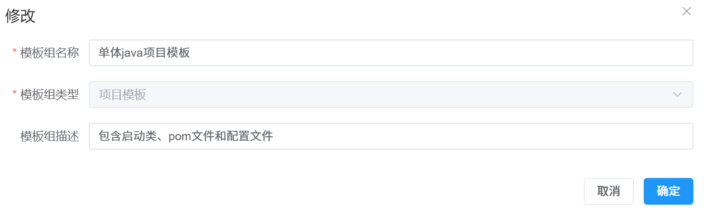

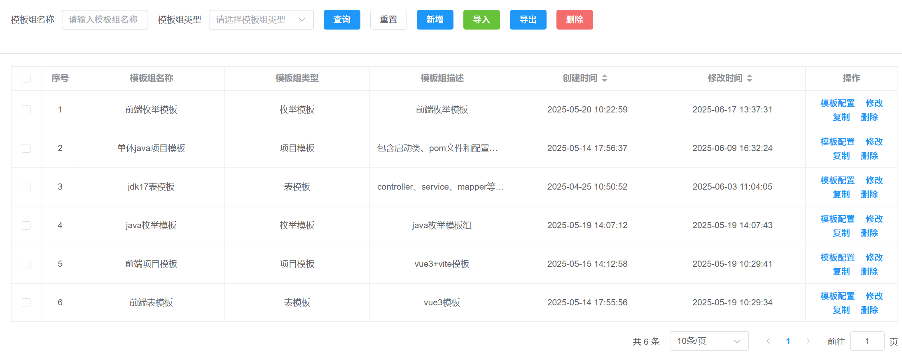

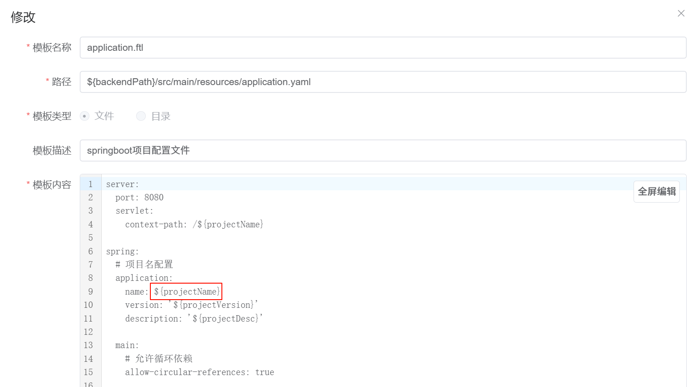

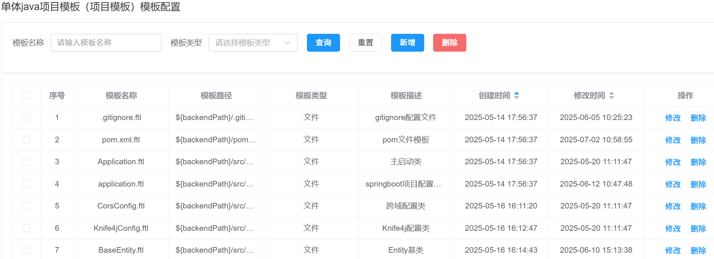

### 4.5 枚举管理

枚举例如性别有男和女，SexTypeEnum（0-男，1-女）。通过配置枚举数据，然后配置枚举模板，前后端代码可以生成枚举代码。

枚举和枚举项是一对多的关系，一个枚举可以有一个或者多个枚举项。

枚举是属于项目的，一个项目可以有一个或者多个枚举，是一对多的关系。

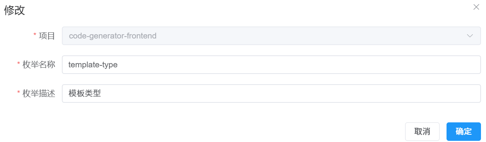

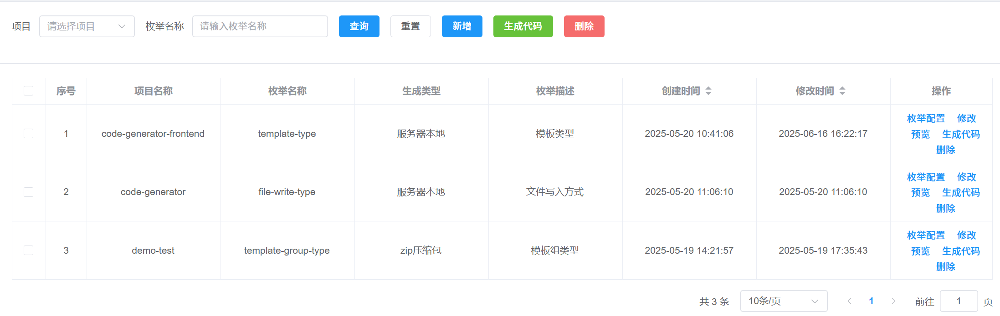

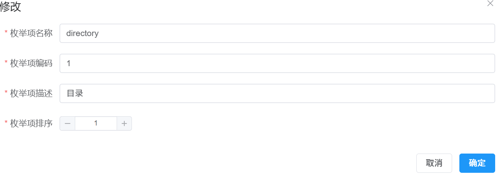

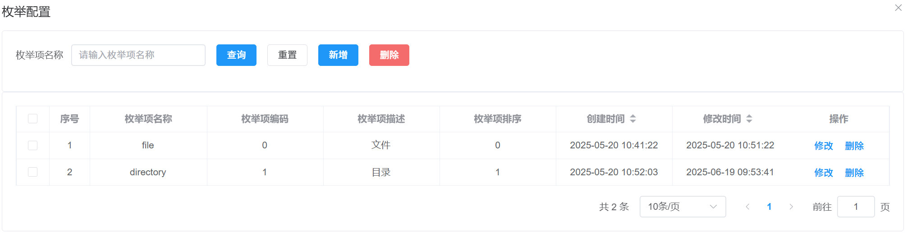

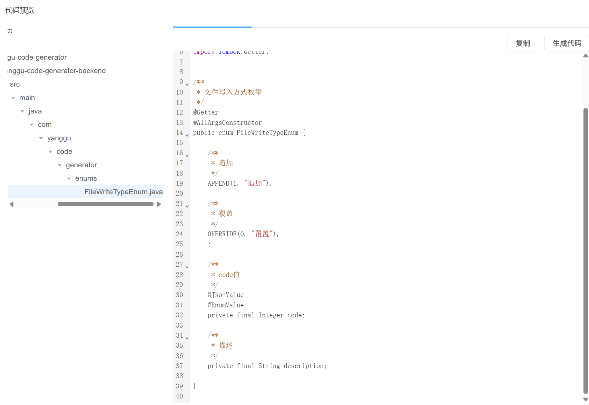

### 4.6 表管理

表是通过项目生成时自动导入数据源下的表或者手动导入，表是代码生成的核心。

通过配置项目的表模板，可以生成大量前后端增删改查代码。

例如user表，通过表模板可以生成后端代码UserController.java、UserService.java、UserEntity.java等，生成前端代码userApi.ts、user-add-or-update.vue、user-index.vue等。

通过字段配置功能，可以修改字段的属性。例如配置字段为查询字段、列表字段、input输入、下拉选择和复选框等。

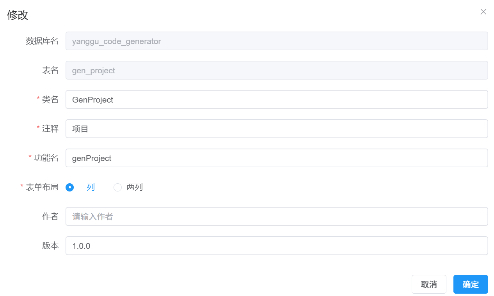

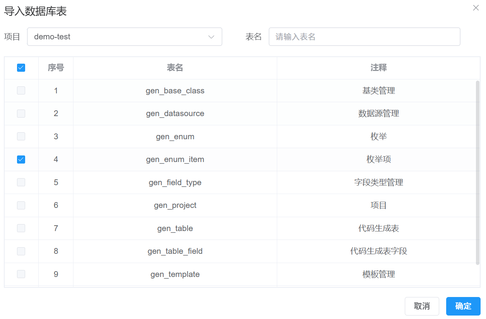

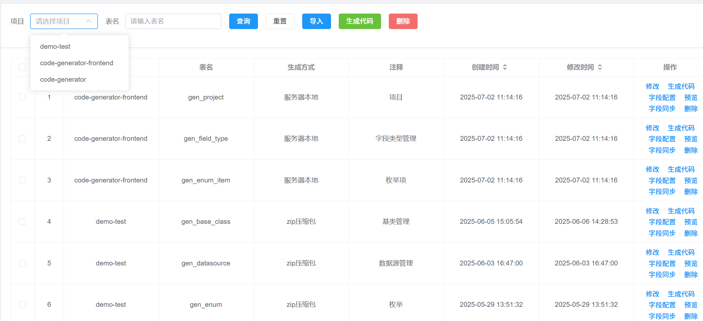

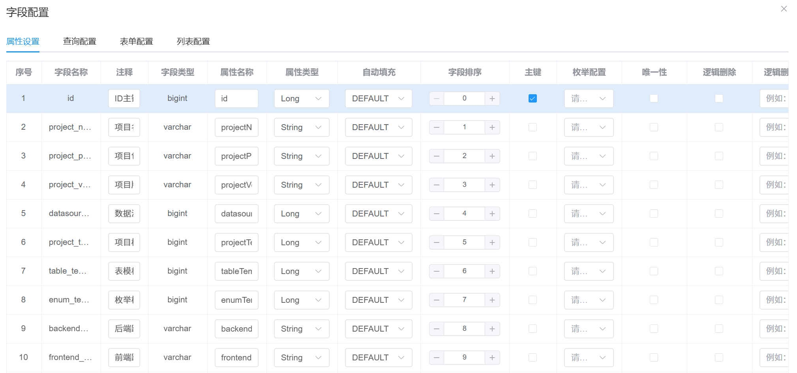

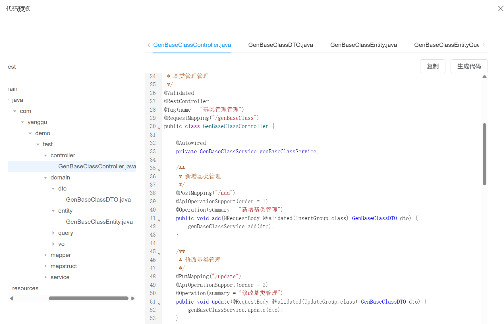

### 4.7 项目管理

项目是代码生成的核心模块，基于项目来管理表、枚举。

项目需要配置数据源，项目在新增时会自动导入数据源下的所有表。

在项目中配置项目模板、表模板和枚举模板。基于项目下的表、枚举和项目配置数据，能够生成前后端代码。

生成方式有zip压缩包和服务器本地两种。zip压缩包是将生成代码打包成一个zip压缩下载到浏览器。服务器本地是将生成的代码文件直接生成到服务器本地中。

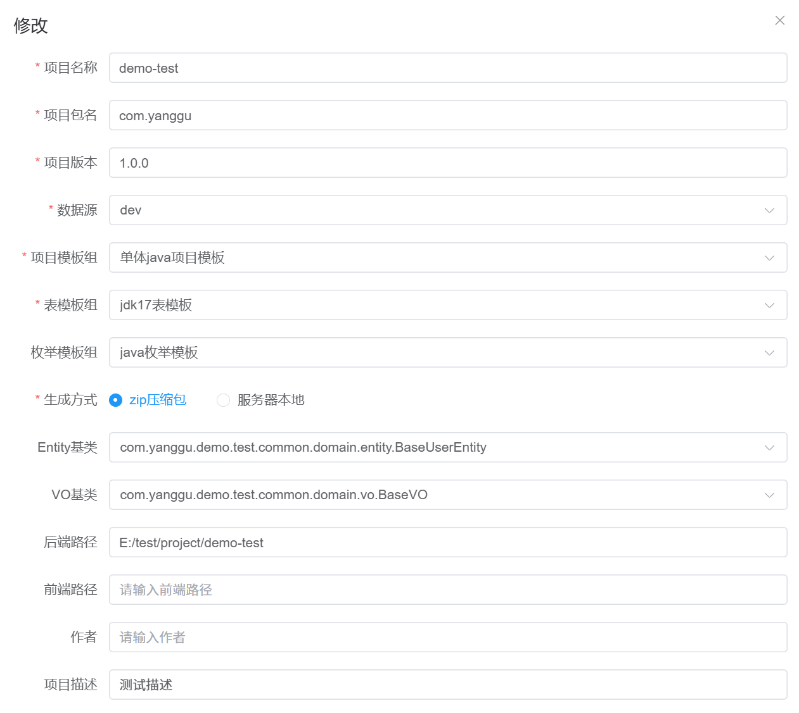

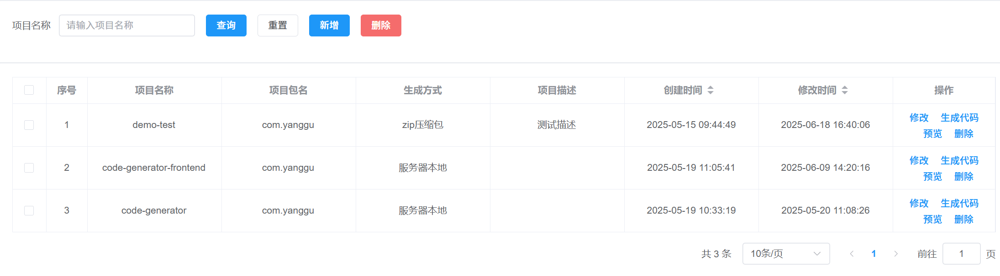

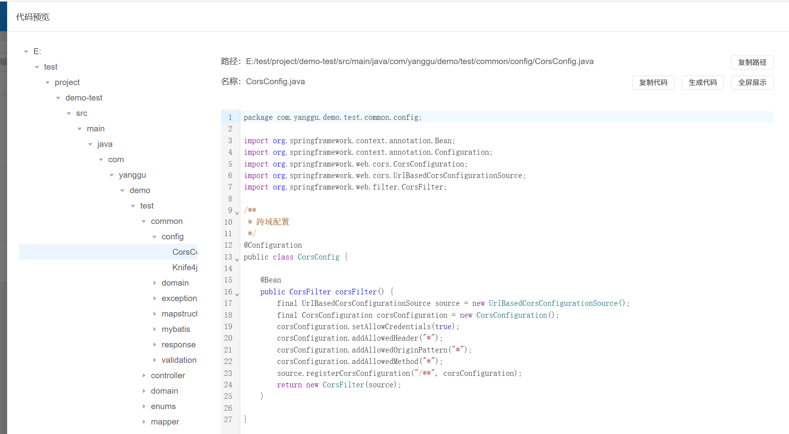


## 5. 内置模板

在项目template文件夹下内置了一些前后端模板，可供参考。

```yaml
template
└───default
    ├───backend
    │   ├───enum
    │   ├───project
    │   │   └───common
    │   │       ├───config
    │   │       ├───domain
    │   │       │   ├───entity
    │   │       │   ├───query
    │   │       │   └───vo
    │   │       ├───exception
    │   │       ├───mapstruct
    │   │       ├───mybatis
    │   │       │   ├───config
    │   │       │   ├───mapper
    │   │       │   └───util
    │   │       ├───response
    │   │       └───validation
    │   │           ├───code
    │   │           └───group
    │   └───table
    │       ├───java
    │       └───xml
    └───frontend
        ├───enum
        ├───project
        │   ├───hooks
        │   ├───types
        │   └───utils
        └───table
            ├───api
            └───views
```

path.md文档用于说明模板的用途和路径
