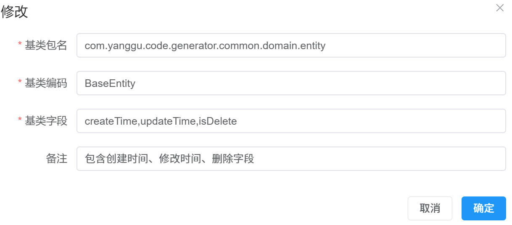
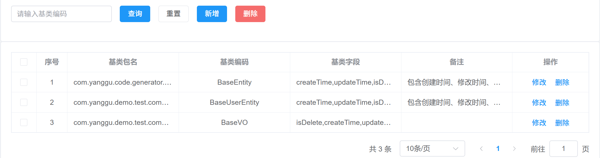
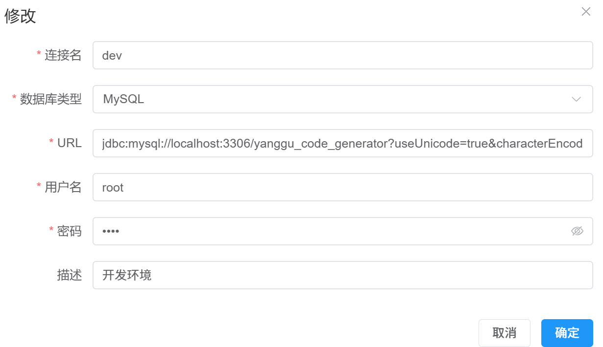
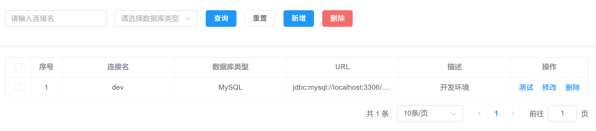

# 代码生成器
## 1. 项目说明
- yanggu-code-generator是一款低代码生成器，可根据自定义模板内容，快速生成代码，可实现项目的快速开发、上线，减少重复的代码编写，开发人员只需专注业务逻辑即可。
- 本项目前端页面和后端表结构大部分来自maku-generator项目。进行了部分改动，增强了一些功能，同时修复了一些bug。
- 项目是一个前后端分离的，标准的springboot单体后端和vue3+vite单体前端。
- sql文件夹下存放了数据库脚本
- template文件夹下存放了一些默认的代码模板，分为后端代码模板和前端web代码模板
- yanggu-code-generator-backend是后端springboot项目
- yanggu-code-generator-frontend是前端vue3+vite项目

## 2. 运行环境

1. JDK 21
2. Mysql
3. vue3
4. vite
5. nodejs

## 3. 部署说明
### 3.1 后端项目
1. 创建数据库yanggu_code_generator
2. 运行sql文件夹下的yanggu_code_generator.sql文件
3. 修改application.yml，更新MySQL账号和密码、数据库名称。主启动类YangguCodeGeneratorApplication，进行运行
### 3.2 前端项目
1. npm install
2. npm run dev
### 3.3 访问地址
http://localhost:5000/#/gen/project

## 4. 功能说明
### 4.1 字段类型管理
字段类型管理可以对数据库类型到Java类型的一个映射配置。可以进行新增、修改、删除、查询等。已经内置了大量基础数据。

### 4.2 基类管理

基类主要是对Entity和VO进行统一管理。定义包名、类型和基类字段等。

### 4.3 数据源管理

数据源管理通过配置链接的元数据信息（数据类型、url、用户名和密码等），让项目进行引用，然后导入数据库下的表，进而根据模板生成代码。

### 4.4 模板组管理

模板组管理是整个代码生成器的核心内容。通过自定义模板，渲染项目、表、字段、枚举和枚举项数据生成前后端代码。模板组分成3个大类。项目模板、表模板和枚举模板。

- 项目模板
  - 主要使用是配置一些项目的初始化文件。例如配置文件、依赖文件和初始化文件等
  - Java的springboot项目需要配置pom.xml文件、application.yaml文件等
  - Web的vue3项目需要配置package.json、main.ts、App.vue和index.html等内容
  - 这些文件只会配置一次，只有一个，不会配置多次
- 表模板
  - 基于数据源下的表以及表的字段，生成一些增删改查文件。
  - Java基于user表可以生成UserController、UserService、UserServiceImpl和UserEntity等文件
  - Web的vue3基于user表可以生成user.ts（调用后端接口api文件）、add-or-update.vue表单和index.vue分页页面。
  - 一个项目配置一个数据源，数据库库下会有多个表，因此会执行多次。
- 枚举模板
  - 基于配置的枚举和枚举项，生成枚举文件。
  - Java基于UserType枚举生成UserTypeEnum
  - Web的vue3基于UserType枚举生成枚举常量
  - 一个项目配置多个枚举，因此会执行多次。

